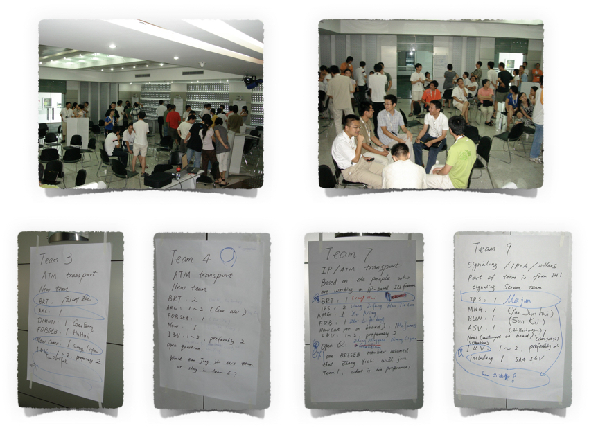
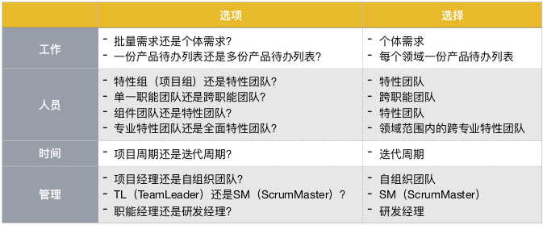
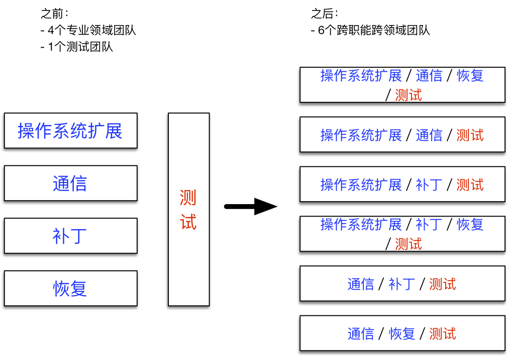
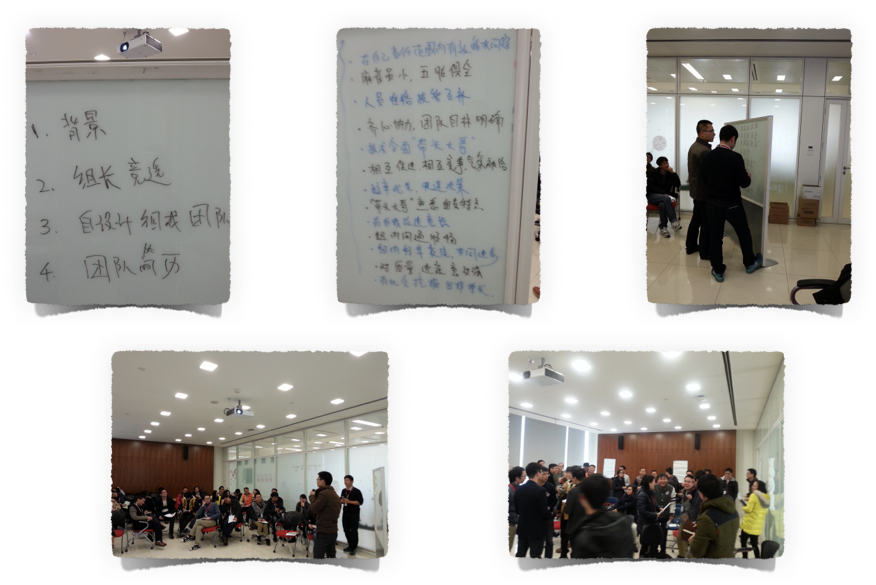
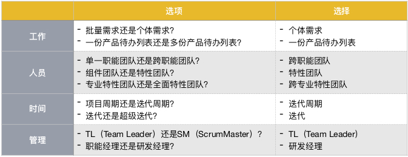
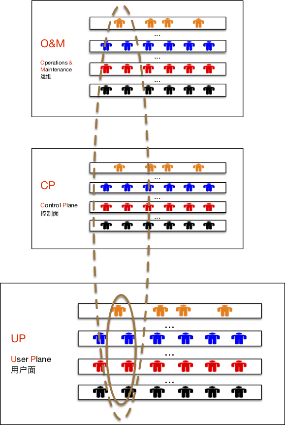
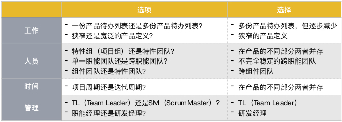
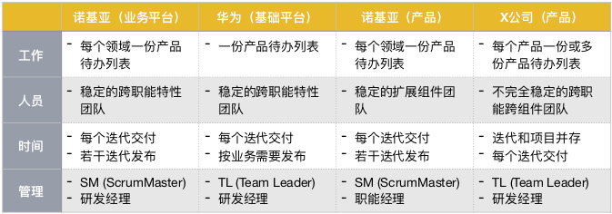

#第十章 组织设计和变革实战

最后一章我们来看几个组织设计和变革的实例。我们将围绕四个我亲身经历过的组织设计和变革实例来看其中采用的设计选择和变革策略。

##1. 诺基亚（业务平台）

###1.1 背景和目标

这是我第一次有机会深入地参与组织设计和变革。主要的组织设计和变革过程发生在2007-2008年，是在诺基亚网络的一个业务平台，它的主要用户是3G网络中的RNC（无线网络控制器）。大约500人的规模，分布在中国杭州和芬兰赫尔辛基两地。在前期我是作为一个具有敏捷产品开发经验的项目经理参与讨论，在过程中我被选为带领其中的一个约100人规模的开发领域，因此有机会深入地改变至少该领域的组织结构。

整个业务平台变革的动力主要来自两方面，一是适应性，变革之前的产品发布周期通常是2-3年，使得很多客户需求从提出到交付的过程非常漫长。二是质量，尤其是发布前期的缺陷数目居高不下，带来的后果是或者延期，或者在缺陷数目还未足够收敛时就发布产品，导致客户问题变多。

简而言之，这次组织变革的系统优化目标是在保证质量的前提下缩短特性交付的周期。

###1.2 组织设计和变革

整个业务平台的开发模式在变革之前是典型的项目模式（参见第三章），1）基于批量需求，2）组成项目组，3）按项目周期计划和发布，和4）项目经理是最核心的管理角色。

为了优化系统目标，我们选择从项目模式转变为持续产品开发模式（参见第三章），1）聚焦个体需求，2）组建长期稳定的跨职能特性团队，3）按迭代周期计划和交付（进而缩短整体的发布周期），和4）自组织团队成为管理的核心部分。

以下几点是组织设计和变革策略在这个实例中的呈现。

1. 去项目化

	按产品而非项目组织需求是围绕工作方面所做的最重要设计选择。这意味着项目不再是核心，所有项目工作加上维护工作都进入产品待办列表，使得产品待办列表成为整个组织工作的唯一来源。由此带来的是对项目经理的影响，项目经理的作用只局限于对外的接口，所有工作的优先级都由PO团队来决策。

1. 需求领域

	以该组织的规模（500人，几十个团队），将所有的工作以一份产品待办列表来管理实际上是困难的，因此我们划分了需求领域，每个领域有一份产品待办列表。对应到我所带领的开发领域就有一个需求领域，也就是大约10个团队来共享一份领域产品待办列表，由一个领域PO来对所有工作的优先级进行排序。

	需求领域多大合适的问题受到两个因素的限制，一是领域PO能对多大规模的工作进行有效地优先级排序；二是团队能在多大领域范围内具备广度的技能来按优先级有效地交付。我们首先碰到的是来自PO的限制，领域PO面对如此规模的领域需要分而治之，因此我们实际上拆分了两个需求领域来进行单独的管理。我们并没有碰到团队层面技能广度的限制，一部分原因是刚开始转变时只是把现有的项目工作集成到产品待办列表，并没有引入业务层面大的内容和优先级的调整；另一部分原因是需求领域的划分首先发生了。

	开发领域是我们的直线组织，我所带领的是其中一个。我们绑定了需求领域和直线组织，以加强开发领域对需求领域的承诺和归属。这带来了一系列问题，最主要的是需求领域本质上是动态的业务领域，将它和直线组织绑定就意味着当需求领域变化时，相应的直线组织也要改变。比如我们在某个需求领域需要投入更多的团队，希望从另一个需求领域中移团队过去，这样的改变因为涉及直线组织就变得复杂。尽管我们成功地做出几次调整，中间的开销实际上打击了继续这样做，由此降低了跨需求领域整体优化的灵活性。

1. 跨职能特性团队

	跨职能特性团队是承担工作的基本组织单元。跨职能和跨组件（也就是特性）这两个团队特征是为了让特性能够在迭代内完成。我们采用了自设计团队的方式（如下图所示）：管理层只是就团队规模和这两个团队特征做了限制，其余的人员组合就交给团队自己决策了。

	

	跨职能团队中包含测试对优化系统目标至关重要，因为在迭代内完成测试加速了质量反馈，减少了在制品，从而缩短特性交付周期。事实上，因为无法把所有测试环节都马上加入到迭代的完成定义中，我们仍然不能达到每个迭代发布，但是确实减少了从迭代完成到发布所需要的工作。这为缩短发布周期打下了坚实的基础。

	需求领域共享一份产品待办列表对团队提出了技能广度上的要求。理论上讲，所有的团队要能做所有的需求，但实际上这并不需要。团队仍然可以保留一定程度的在客户领域上的专业化，只要它不对优先级排序产生限制。客户领域与技术领域虽然不是一一对应，但也绝非是完全的多对多关系，所以团队也仍能在技术领域保留一定的专业化。

	当PO对应团队的数目超过两个时，需求澄清就无法让PO来独自承担，由他澄清完后再喂给团队。即使工作量可行这样做也是引入了交接浪费，其实这本就应该是跨职能团队的一部分。提升团队的需求澄清能力是实施该变革中的一个关键。团队由多人组成，需求澄清的能力就象其它的开发或测试能力一样，不需要人人都是一样的程度，关键是团队里有多人能够主导澄清工作，所有人都能积极理解。为了支持这个能力拓展过程，我们引入了特性负责人的角色，它只是关联到特性，所以不同的特性它的负责人是不同的，由团队内部自行商量决定由谁承担。这样随着时间的推移，整个团队的需求澄清能力得到拓展。

1. 从项目到迭代

	在项目模式里，计划和发布是以产品版本为单位的；而在持续产品开发模式里，计划和交付（理想情况下是发布）是以迭代和需求为单位的。

	电信产品（包括该业务平台）的特性通常比较大，因此特性会被拆分成若干需求。我们把特性计划放到每个迭代的产品待办列表梳理活动中去做，从而特性计划成了持续的活动，只是第一次做该特性的计划时会花费多一些时间而已。以更小的单位（特性或者需求）来做计划和交付还是为了能够缩短交付周期以提高适应性。需求变更的概念不复存在，每个迭代都可以改变内容，具有多大的灵活性取决于迭代的长度和特性的拆分程度。

	从项目到迭代的转换时有些项目还在进行中。因为过去采用的是瀑布式开发，因此多半留下的“只是”测试工作。我们的处理方式是将这些测试工作也加入到产品待办列表，不是作为测试条目，而是作为需求条目，“仅剩”测试工作（实际上，当然还有工作量经常比测试还更大的缺陷修复）。

1. “管理”自组织团队

	在跨职能特性团队之前，特性是由项目组来交付的。除了项目经理之外，TL（Team Leader）负责职能团队和组件团队，由他来负责分配人员到项目组，通常他也会管理自己职能和组件范围内的工作进度。

	跨职能特性团队的建立使得需求可以直接落到团队，团队可以通过自组织来完成特性的交付。因此针对跨职能特性团队就不再需要TL（Team Leader）的角色，而是引入了更接近教练的SM（ScrumMsater）角色。这不是常见的重命名做法，把TL变成了SM而已；而是去除了TL的角色，为SM角色进行了招聘。有些前TL作为成员加入了团队，也有些非前TL却担任了SM。

	在跨职能特性团队之前，每个职能部门都是有职能经理管理的。跨职能特性团队的建立使得职能经理和团队没法再一一对应。我们去除了职能经理的角色，而引入了研发经理。每个跨职能特性团队都向同一个研发经理汇报，以便于团队目标的对齐。一个研发经理会对应3-4个跨职能特性团队。

---

总结起来，以下是这个实例中涉及的主要组织设计选项。

##2. 华为（基础平台）

###2.1 背景和目标

我在华为参与组织设计和变革的经历是以外部咨询师的身份，主要的工作发生在2015-2016年，是在华为的一个基础平台，它被很多华为产品和业务平台所使用。该组织只在杭州一地，大约40人的规模。

因为我被雇佣的初衷就是咨询基于LeSS框架的大规模产品开发，所以组织设计选择是围绕LeSS展开的。LeSS框架的系统优化目标是适应性，对于他们来说，很重要的方面就是能够“随时”提供具备发布质量的基础平台，从而使得最有价值的特性能更快地供产品和业务平台集成使用。

###2.2 组织设计和变革

该基础平台的组织变革最主要的也是从项目模式转变为持续产品开发模式，由此我们实现整体最大化交付需求的价值和在每个迭代做到完成。以下几点是组织设计和变革策略在这个实例中的呈现。

1. 去版本化

	在变革之前，需求是放入版本中进行计划和发布的。存在并行版本，由不同的版本经理负责。去版本化是指将所有的工作（所有版本的所有需求、维护工作等）放入一份产品待办列表进行优先级排序。版本作为一个跟外部交流的概念依然存在，但内部开发已经不再以版本为单位。同样地，版本经理的角色也不再存在，只有一个PO，其他部门同该组织的交流是直接和PO进行的。有趣的是，其他部门的人还是可以认为他们有版本经理，只是无论什么版本，都是那位PO。

1. 跨职能特性团队

	为了能做到一份产品待办列表并在每个迭代完成交付，我们组建了跨职能特性团队（如下图所示）。
	
	
	
	这里有两个主要的变化。一是解散了测试职能团队，事实上同时也去除了测试直线经理的角色，使得所有团队成员都汇报给同一个直线经理。二是每个团队都跨领域，这是为了实现一份产品待办列表。最理想的情况是每个团队都能跨所有的领域，但它是一个充分不必要条件。通过一定程度的跨领域，同时保留一定程度的领域专业化，我们可以在利用专业化的优势和不被专业化所限制之间有所平衡。

	对于团队结构变革我们也是采用了自设计团队的做法（如下图所示）：管理层只是给出了一些限制条件，大家自行决定各团队的组成。

	
	
	值得指出的另一个设计选择是关于给团队设置TL（Team Leader）还是SM（ScrumMaster）的角色。这根本上是一个自组织团队能否自行问责的问题。该组织并未准备好完全的团队问责，因此仍然选择了TL的角色，由TL和团队一起共同问责。不过选择TL的过程还是打破了由管理层指定的常规方式，而是采用了自由竞选的方式。

	因为只有一个PO，需求澄清的工作需要由团队直接和干系人来进行。这其实也是团队跨职能的一部分。

1. 迭代完成

	在变革之前需求的计划和发布是基于主要用户（产品或者业务平台）的超级迭代周期来进行的。因为该基础平台面对许多用户，相互之间的影响使得这样的计划很脆弱，所以我们开始转向关注于迭代，以便能够更灵活地响应变化。

	每个迭代做到完成可发布是提升适应性的关键。变革之前我们的迭代交付离发布标准仍有大约两周的工作，通过持续改进，我们在半年时间内将它缩短为三天。这意味着“只要”提前三天通知基础平台，他们就可以交付一个包含最新特性并达到发布质量的版本。

针对这个实例的更多细节可以参见[LeSS在华为](https://yihuode.io/articles/324)的案例。

---

总结起来，以下是这个实例中涉及的主要组织设计选项。

##3. 诺基亚（产品）

###3.1 背景和目标

这是我在离开诺基亚若干年之后以外部咨询师的身份参与的一个实例。主要的组织设计和变革发生在2017年，是在诺基亚4G网络LTE产品组织中的一个需求领域。实际上该领域跨越多个地点，但真正有所变革的部分只是局限在杭州一地，大约30人的规模。

当时该产品组织在导入LeSS，因为其整体规模有几千人，即使在LeSS巨型案例里也算是超大规模的，所以采用的变革策略是渐进式的（参见第九章中的增量式结构变革）。整个组织采用了“直接穿透”的方式选取了两个需求领域来进行，这是其中的一个。

LeSS优化的系统目标是适应性，但在这个实例中我们更多关注在特性交付的周期时间上。这里的特性非常大，一个特性就是一个需求领域。当然我们会先发布特性的一部分，然后获取反馈，再进一步迭代增量地发布后续版本。

###3.2 组织设计和变革

需求领域的建立就是为了能够端到端地交付特性。我们的组织设计和变革主要围绕在需求领域内多团队共享一份产品待办列表，从而作为一个整体来优化特性交付的价值和周期时间。

以下几点是组织设计和变革策略在这个实例中的呈现。

1. PO和产品待办列表

	需求领域有一个领域PO，归属于产品管理部门。这是个重要的变化，因为它反映了产品管理而非项目管理的视角。项目管理中固定范围的思路与适应性背道而驰，而产品管理则更有可能关注产品目标。需求范围只是达成产品目标的途径，调整范围是为了更好地达成产品目标。

	需求领域有一份领域产品待办列表，包含了该领域特性交付的所有工作。这一点其实与项目并无不同，项目也是包含特性交付的所有工作，但是项目由临时的项目组来做这些工作，而需求领域则由若干长期稳定的跨职能特性团队组成。可惜的是，该组织的特性团队只覆盖了部分领域工作，所需其它技术领域的工作仍然以项目的方式管理，尽管它们也被包含在同一份产品待办列表里。

1. 特性团队

	采用“直接穿透”方式组建需求领域的特性团队本意是要跨需要的所有技术领域（见下图虚线所示），但是这一点在这次变革中很不顺利，因为缺乏足够的共识，最后形成的“特性团队”只是在一个技术领域（UP / 用户面），其余技术领域（O&M / 运维、CP / 控制面、硬件平台）都没有被集成到特性团队，而只是以传统项目组的方式参与进来。我们实际上只是组建了4个在UP技术领域内的跨组件团队（见下图实线所示）。

	
	
	即使对于UP技术领域内的“特性团队”，我们也没有打破之前的组件团队加以重组，而只是在其基础上加以扩展。SM在组件团队时就已存在，同时保留了负责组件团队的直线经理。事实证明，这一导入特性团队的策略过于保守，新的团队设计并不足以支持实现系统优化目标。

	团队在扩展组件技能以在UP范围内能够独立交付上面做出了努力，但是因为在团队设计上的不充分导致事倍功半。产品待办列表里的条目是客户视角的需求，这对促进“特性团队”扩展技能至关重要。当某个迭代需要扩展许多技能时，团队之间会协商安排旅行者。旅行者会从一个团队全职加入到另一个团队一段时间，以帮助另一个团队构建缺失的技能。这本身是有效的方式，但是因为对形成特性团队这一目标的共识不够，一旦交付压力变大，就会倾向于由旅行者直接把他熟悉的组件工作给做了，实际上退化为传统项目组的方式。

1. 迭代完成

	虽然需求在产品待办列表中按迭代来计划，因为团队结构并没有相应地穿透，各技术领域之间的优先级经常无法同步，所以在迭代内很难真正端到端做到完成。尽管我们采取了基于硬件原型、对其它技术领域的组件打桩等方式来推进特性的开发，迭代完成的交付后续仍需较长的稳定期才能发布。这进一步指出了就系统优化目标而言我们所做组织设计和变革上的不足。

---

总结起来，以下是这个实例中涉及的主要组织设计选项。

##4. X公司（产品）

###4.1 背景和目标

这是我作为外部咨询师参与的最近一个实例，发生在2017-2018年，事实上仍在继续。X公司是一家电梯物联网行业的创业公司，产品研发的规模从几十人增长到现在的一百多人。组织设计和变革在产品研发范围内进行，包括产品管理。

该公司的业务有一部分相对成熟，另一部分则处在探索期。探索期的业务要求组织有很好的适应性，而成熟期的业务也要求特性交付的周期时间尽可能短。

###4.2 组织设计和变革

迭代开发是优化适应性和周期时间系统目标的关键实践。一份产品待办列表有助于全局优化调整；而特性团队有助于缩短特性交付的周期时间。同时由于是物联网产品，涉及硬件设备和算法，因此形成的专业化给组织设计带来了一定的限制。

以下几点是组织设计和变革策略在这个实例中的呈现。

1. 产品定义

	到底我们有几个产品这个问题听起来很简单，事实上却是一个很复杂并重要的问题。从适应性的角度来看，宽泛的产品定义更能保持灵活性，比如某块业务更具价值，我们可以容易地将与之相关的需求提高优先级。但是每个产品都有各自的产品待办列表，产品间的调整会比产品内的调整更为困难。通常产品间的调整属于投资组合管理的范畴，它的调整周期通常是比较长的。从这个意义上讲，我们倾向于把该组织所有的业务定义为一个产品，然而还有其它方面的考虑。

	该组织总共有四块业务：
	
	* ABC是安装在电梯上的设备，监控电梯的运行状况并产生告警，比如困人告警、故障告警等。
	* 政府救援是和ABC连接的救援平台，由ABC和其它方式产生的告警促发处置流程。
	* 物业管理是电梯管理延伸出来的系统，除了电梯管理比如维保之外，还包括其它物业应用场景。
	* 广告是基于ABC设备屏幕的广告投放。

	这几块业务各具特征，由此产生对产品和研发的专业化需要。几块业务的成熟度也不尽相同，ABC和政府救援相对成熟，而物业管理和广告则处于探索期。这些因素使得我们决定采用更为狭窄的产品定义。

1. 产品待办列表

	迭代交付本来是个简单的组织设计选择，但是因为ABC涉及硬件和算法工作，其周期都较长，所以采用了迭代和项目并存的模式。对ABC的部分工作还是采用了项目模式，其余则基本都采用迭代模式。

	迭代模式基于产品待办列表，我们是一个团队还是多个团队有一份产品待办列表？产品待办列表的份数越少，我们越能全局优化客户价值，但同时对团队的技能广度有越高的要求。我们基于实际情况以每个团队有一份自己的产品待办列表作为起点，但同时开始为每个产品建立一份整体的产品待办列表。关键是整体的产品待办列表不是各个团队产品待办列表的叠加，而是从整体最大化客户价值的视角得出的优先级排序。当两者之间有差距时，就会促发思考和讨论，是否让团队扩展专业以能按全局的优先级来工作。这一变革策略是切实可行的，产品待办列表的份数在逐步减少。

1. 跨职能特性团队

	产品待办列表中的条目是客户需求，因此只有跨职能特性团队才能独立的完成交付。理想情况下这意味着特性团队能改动所有的组件，但这样做要求的技能广度也最高。事实上有些组件已经相对成熟，特性开发并不需要它们大的改动，而相关技能的广度学习成本又比较高，为此我们结合实际工作创建跨组件团队，尽可能地让团队能够独立交付特性。在特性交付需要多团队协同时，该特性需求只会出现在某一个团队的迭代待办列表中，该团队需要承担起端到端交付特性的职责。

	考虑到团队成员和组织的成熟度，我们决定跨职能特性团队仍然由TL（Team Leader）负责，并汇报给统一的研发经理。ABC因为采用项目和迭代并存的模式，这部分的测试职能依然独立存在，但尽量让测试人员稳定地加入到某一个跨职能特性团队。

1. 迭代完成

	迭代完成是提升适应性的必要条件，但是我们的现状是迭代经常不能做到完成。尽管也有些团队能在每个迭代结束发布版本，版本质量却不够好。迭代发布后的反馈有两方面，一方面是质量，通过客户缺陷能有所反映；另一方面是价值，通过业务度量能有所反映。建立这两方面的反馈并以此指导我们接下来的调整是实现系统优化目标的关键。

---

总结起来，以下是这个实例中涉及的主要组织设计选项。

##总结

以上四个实例的一些重要组织设计选择总结如下：

通过系统思考，我们深入理解当下的因素和动态，围绕系统优化目标来设计和变革我们的产品开发组织。希望这本书提供了一些具体应用系统思考来指导组织设计和变革的有用思路。
