#第二章 系统思考

因为我们会在书中大量应用系统思考来分析组织设计选择和变革策略，所以本章试图给大家做些必要的知识准备。但这不是一本全面介绍系统思考的书，除了阐述最基础的概念外，我们会结合产品开发组织相关的例子来帮助大家快速地看到系统思考和大规模产品开发组织这个话题的相关性，同时重点分享自己在实践系统思考过程中形成的一些理解和洞察。

##1. 系统思考

本书的副标题是“用系统思考指导组织设计和变革”。为什么用系统思考？彼得·圣吉在《第五项修炼》中区分定义了细节复杂度和动态复杂度。细节复杂度以涉及变量多为其特征，而动态复杂度却以因果关系之间的微妙为其特征。因和果经常不在同一时间和空间发生，由此带来了高的动态复杂度，而系统思考能帮助我们更好地理解这样的问题并进行有效干预。大规模产品开发组织的设计和变革不仅是细节复杂的，还是动态复杂的，因此适合用系统思考来分析并指导。

系统思考本身的定义也有一定的模糊性，我们书中采用的概念和工具都来自于美国麻省理工学院的福瑞斯特教授奠基的系统动力学。系统动力学包含的主要工具有四个：因果回路图（CLD - Causal Loop Diagram）、行为趋势图（BoT - Behavior over Time Diagram）、存量流量图（SFD - Stock & Flow Diagram）和计算机模拟（Computer simulation)。系统思考的很多洞察是反直觉的，而基于计算机模拟的定量分析能够让我们产生新的洞察并改变我们的心智模式。但是考虑到1）就组织设计和变革的话题通过数学建模进行定量分析的方式并不成熟，2）基于CLD的定性分析和批判性思考已经能推动我们改变心智模式（对因果关系的思考从线性转向回路），所以本书将以CLD作为系统思考的建模和分析工具。

##2. 因果回路图（CLD：Causal-Loop Diagram）

CLD（Causal Loop Diagram / 因果回路图）在一般的系统思考书（比如《系统思考》）里都有介绍。它基本的要素有：变量、链路和回路，我们接下来对这些要素逐一介绍。

###变量

变量是我们建模的系统结构里的因素，它的值是随时间而变化的。在产品开发组织中，常见的变量有：人数、需求量、交付周期、速度、灵活性、质量、价值、士气、满意度等。

定义变量时有以下注意点：

* 变量是名词。比如“加快”就不是一个变量，背后的变量可以是“速度”，它可以变快或者变慢
* 变量可以是有形的，也可以是无形的。比如变量“人数”是有形的，而变量“士气”是无形的
* 变量可以被分解成更精细的变量。比如变量“需求量”可以进一步被定义成变量“需求个数”和“需求大小”

###链路

变量之间可以形成链路，这个链路是因果链路。变量A到变量B的链路是指，假设其它因素都一样的情况下，A的变化会导致B的变化。根据两者变化的方向是否一致，链路有两种不同的极性。它可以是正向的，以“+”标注；也可以是负向的，以“-”标注。链路上可以有延迟，以“||”标注。

我们通过两个例子来说明。

####1. “需求量”和“人数”之间的链路

“需求量”变多，“人数”是变多还是变少，还是两者之间没有关联（也就是不形成链路）？

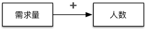

一种解释是，“需求量”变多，“人数”变多，因为我们会招更多人做需求。这样就在“需求量”和“人数”之间形成了正向的链路。

当这样考虑时，我们发现“人数”作为一个变量其实并不准确，它指的可以是“需要人数”，也可以是“实际人数”。下图通过把这些变量区分，使得背后的因果关系能更清晰地呈现出来。注意这里“招聘”本身不是变量，但是“招聘力度”是一个合适的变量，它可以变大或变小。

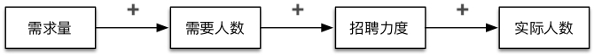

“需求量”变多，“需要人数”变多，“招聘力度”变大，“实际人数”变多。

在上述三个链路中是否存在延迟呢？延迟本身是相对的概念，有和没有的背后其实是个连续体，也就是延迟的多少。在定性分析时，我们判断这个延迟对该动态的影响程度来决定是否呈现它。比如，考虑从加强“招聘力度”到增长“实际人数”之间有重大的延迟，我们就决定把它呈现在“招聘力度”到“实际人数”的链路上。

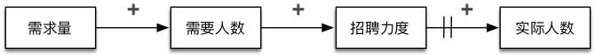

“需求量”变多，“需要人数”变多，“招聘力度”变大，（经过一段时间后）“实际人数”变多。

除了正向 / 负向（“+” / “-”）之外，另一种常见的链路变化方向表述是同向 / 反向。同向以“s”标注，代表“same direction”；反向以“o”标注，代表“opposite direction”。本书采用了正向 / 负向的表述方式，是基于以下原因。

“招聘力度”变大，“实际人数”变多，在这个方向上两者是同向的。那么“招聘力度”变小，“实际人数”变少吗？只要是在招聘，实际人数是不会变少的，在这个方向上两者似乎并不同向。所以这里用同向 / 反向的表述会让人有些困惑，而正向 / 反向的表述则更为准确。正向 / 负向究竟是什么含义呢？准确的说法应该是，“招聘力度”变小，“实际人数”相比按之前的招聘力度能获得的实际人数变得更小。因此无论从哪个变化的方向看，它都是正向的关系。

####2. “加班量”和“产出”之间的链路

“加班量”和“产出”之间有链路吗？是正向还是负向的？

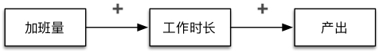

一种解释可以是，“加班量”变多，“工作时长”变长，“产出”变多。这是正向的链路。

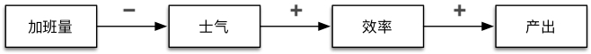

而另一种解释可以是，“加班量”变多，“士气”变低，“效率”变低，“产出”变少。“加班量”和“士气”之间是负向的链路。这个负向链路也使得从“加班量”到“产出”整体也是负向的，因为其余的链路都是正向的。要判断两个变量之间最终的因果关系，只需数其中负向链路的个数，如果是偶数个，就是正向的；如果是奇数个，就是负向的。

这样一来“加班量”和“产出”之间形成了两条链路，一条是正向的，而另一条是负向的。综合起来是正向还是负向就需要通过量化分析才能决定了。

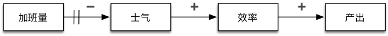

同样地，在“加班量”和“士气”之间也存在延迟，考虑到加班了一段时间后士气才降低。“加班量”变多，（经过一段时间后）“士气”变低，“效率”变低，“产出”变低。延迟不会改变链路的极性，但是我们会在后面看到它对形成什么样的动态意义重大。

###回路

几条链路可能形成回路。如果从变量A到变量B有一条链路，当从变量B到变量A，之间可能通过一系列其它的变量，也有一条链路时，就形成了回路。有两种类型的回路，一种是增强回路（Reinforcing loop，标注为R），另一种是平衡回路（Balancing loop，标注为B）。

####1. 增强回路（R）

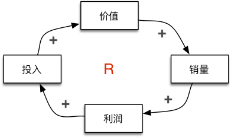

这是一个围绕产品的动态。“价值”变高，“销量”变大，“利润”变高，“投入”变多，“价值”变高，由此形成了一个增强回路。

需要注意的是，我上面把它读成了一个良性循环，我也可以从另一个方向读它。“价值”变低，“销量”变少，“利润”变低，“投入”变少，“价值”变低，由此形成的还是增强回路，但它却是个恶性循环。所以增强回路的特征在于增强，它可以是良性或者恶性。

当形成回路时，给回路命名是重要的思考步骤。回路只是更大动态里的一部分，通过给回路命名，我们就能在更高的抽象层次看待理解整个动态。以刚才的增强回路为例，我们可以把它命名为“价值驱动产品增长”。

###2. 平衡回路（B）

我们继续展开之前“需求量”和“人数”之间的链路，“实际人数”变多，完成的“需求量”变多。。。这时我们发现“需求量”这个变量定义得并不准确，可以把它区分定义为三个与“需求量”相关但又不同的变量 - “完成需求量”、“待做需求量”和“输入需求量”。“待做需求量”是“输入需求量”和“完成需求量”的差值。

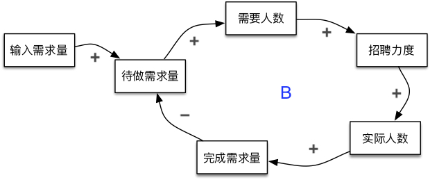

“待做需求量”变多，“需要人数”变多，“招聘力度”变大，“实际人数”变多，“完成需求量”变多，“待做需求量”变少，由此形成了一个平衡回路。我们可以把它命名为“招人完成需求”。

我们平时的生活中也有恶性循环或者良性循环这样的说法，所以在我的经验里掌握增强回路并不困难。更难掌握的反而是平衡回路，因为平衡回路的特征是寻求目标的达成。我们可以把问题定义为目标和现状的差距，这个差距驱动行为的改变，从而导致现状发生变化，差距得以缩小。

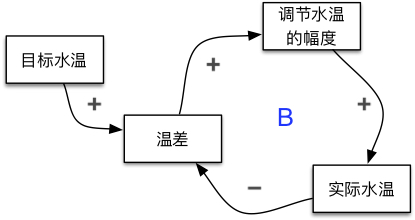

最为经典的解释平衡回路的例子是调节水温，你有一个“目标水温”，有一个“实际水温”，当它们之间有差距时，“温差”驱动你加大“调节水温的幅度”，提升了“实际水温”，使得“温差”缩小，从而减小“调节水温的幅度”，最终实现了“目标水温”，达到了平衡。对应到“招人完成需求”的平衡回路，“待办需求量”其实就是“温差”，招聘相当于调节水温。

我们再看一个平衡回路的例子。

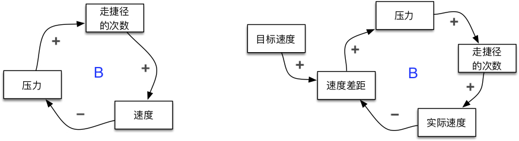

在左图中，“压力”变大，“走捷径的次数”变多，“速度”变快，“压力”变小。走捷径指的是各种牺牲质量但短期能加快的途径，比如少做测试、拷贝粘贴、忽略出错处理等。我们可以把这个回路命名为“走捷径以加速”。这里的“温差”在哪里呢？压力！“压力”其实是由“目标速度”和“实际速度”的差距带来的，而走捷径就相当于调节水温了。我们在右图中把它表述成调节水温的方式其实是一回事。

是增强回路还是平衡回路的判断除了按部就班逐个变量和链路演绎之外，还可以数回路里包含负向链路的个数，是偶数个就是增强回路，是奇数个就是平衡回路。给回路命名的步骤可以作为一个检验，当你发现给增强回路的命名是解决问题或者达成目标之类，而给平衡回路的命名是增长或者衰退之类，就该再仔细查看一遍了。

##3. 系统基模

多个回路互动形成一定的模式，在系统思考里叫做系统基模。常见的系统基模有十个左右，我们书中会涉及到以下几个，接下来会各用一个产品开发相关的例子对它们做个简短的介绍。

###饮鸩止渴（Fixes that backfire）

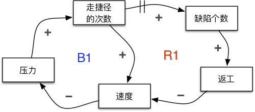

“饮鸩止渴”系统基模由一个平衡回路和一个增强回路组成。上图的例子构建在之前“走捷径以加速”的平衡回路基础上。“走捷径的次数”变多，过了一段时间后，“缺陷个数”变多，导致“返工”变多，“速度”反而变慢，“压力”变大，为了应对，进一步增加“走捷径的次数”，这就形成了一个增强回路，可以命名为“缺陷拖后腿”。意外的后果是“饮鸩止渴”系统基模的关键特征，在这个例子里出现的意外后果是走捷径带来缺陷的增多。延迟在这个动态中起到重要的作用，正是延迟使得意外的后果让人感到意外。

###舍本逐末（Shifting the burden）

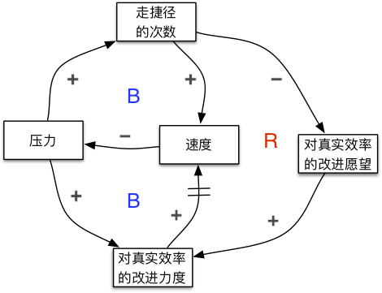

“舍本逐末”系统基模由两个平衡回路和一个增强回路组成。如果“走捷径以加速”的平衡回路（上图左上）是饮鸩止渴的话，有没有其它的平衡回路可以帮助达到目标？上图左下的平衡回路是一种可能性，当需要加速带来的“压力”变大时，我们增加“对真实效率的改进力度”，从而使得“速度”变快，“压力”得以释放，我们把这个平衡回路命名为“改进效率以加速”。对效率的改进措施可以有很多，比如通过培训学习提升技能、加强协作、移除障碍等，这些措施相对于走捷径来说通常需要更长的时间才能见效。而当短期内走捷径看起来起作用时，“对真实效率的改进愿望”就会变低，以致于“对真实效率的改进力度”变低，“速度”变慢，“压力”变大，进而更多地走捷径，由此形成了一个增强回路，可以命名为“上瘾于走捷径”。“舍本逐末”系统基模的关键特征是短期表面方案和长期根本方案之间的张力，因为增强回路的存在，使得我们上瘾于短期表面方案。

###目标侵蚀（Eroding goals）

“目标侵蚀”系统基模由两个平衡回路组成。如果把问题定义为目标和现状的差距，改变现状可以消除差距，改变目标也可以消除差距。这样说来有点自欺欺人，但现实中的例子并不少见，尤其当改变现状需要更长的时间时。上图中呈现的是进度落后的问题，进度落后可以表示为“预期交付时间”和“实际进度”的“偏差”。为了减少“偏差”，有两个方案，也就是两个平衡回路。上面的平衡回路是降低目标的方案，“偏差”变大，“预期交付时间”变长，“偏差”变小，这其实就是延期。而下面的平衡回路是改善现状的方案，“偏差”变大，增加“‘加快’的措施力度”，“实际进度”变快，“偏差”变小。这里的“加快”措施未必指的是加班，虽然一定程度的加班可能对加快有所帮助，过度的加班反而会适得其反。除此之外其实还有很多“加快”措施，比如提升效率、缩减范围等，而这些措施通常需要更长的时间才能见效。正是这个延迟，使得我们逐步转向上面的平衡回路，延期成为一种习惯。“目标侵蚀”从某种程度上来说是“舍本逐末”的一个特例。“舍本逐末”里的两个平衡回路都是改变现状，而“目标侵蚀”里其中一个平衡回路是改变目标。

###成长上限（Limits to growth）

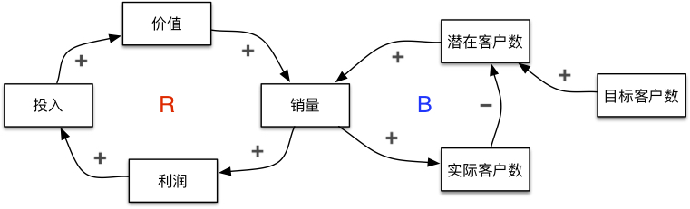

“成长上限”系统基模由一个增强回路和一个平衡回路组成。上图的例子构建在之前“价值驱动产品增长”的增强回路基础上。这里的潜在客户是指产品的目标客户中还未成为我们实际客户的人群，因此“潜在客户数”是“目标客户数”和“实际客户数”的差值。“销量”变大，“实际客户数”变多，“潜在客户数”变少，“销量”变少，销量被目标客户数所限制。这就是我们常说的市场饱和。“饮鸩止渴”和“成长上限”同样都是一个增强回路和一个平衡回路，两者的互动却完全不同。在“饮鸩止渴”中，平衡回路是解决问题的方案，但它带来了意外的后果，形成了处于恶性循环的增强回路，因此我们希望打破增强回路。在“成长上限”中，增强回路处于良性循环，而平衡回路却限制了它，因此我们希望打破平衡回路以使增强回路得到持续。

##4. 建模思路

因为在接下来的章节中会大量地应用系统思考，我们先分享两个动态建模的主要思路，分别应用于组织设计和组织变革。组织设计其实是重新设计，因为现有的设计无论是有意还是无意都存在着。我们用四个问题来驱动对现有设计和可能的替代设计的建模分析，从而理解不同的选择以获得洞察。在组织变革中有效地利用推动力和削弱限制力对促进变革至关重要，我们围绕“成长上限”的系统基模对推动因素和限制因素进行建模分析以获得洞察。

###组织设计

我们用以下四个问题对不同的组织设计选择进行建模分析：

1. 现有做法的意图是什么？
1. 现有做法带来什么后果？
1. 有什么其它的做法能实现现有做法的意图？
1. 为什么其它的做法难以实施？

以研发采用走捷径的做法为例：

1. 走捷径的意图是什么？它想达成什么目标，解决什么问题？达成目标或者解决问题可以用平衡回路表示出来，这就是“走捷径以加速”的平衡回路。
1. 走捷径带来什么后果？尤其是拉长时间来看是否有意外的后果，它反过来对之前目标产生负面的影响，形成“缺陷拖后腿”的增强回路。“走捷径以加速”和“缺陷拖后腿”两者构成了“饮鸩止渴”的系统基模。这些后果也可能影响其它方面的目标，比如质量。假设通过走捷径速度确实变快，但同时质量下降，那样的话就是两个系统目标（速度和质量）哪个更重要的问题了。
1. 有什么其它的做法能加速？加速是走捷径背后的意图，我们可以通过其它做法实现这个意图吗？“提高效率以加速”就是体现另一个做法的平衡回路。
1. 为什么提高效率难以实施？为什么还一直走捷径？这里我们发现增强回路“上瘾于走捷径”的存在解释了背后的原因。

通过这四个问题，我们对走捷径这种做法背后的动态就有了比较全面的分析。

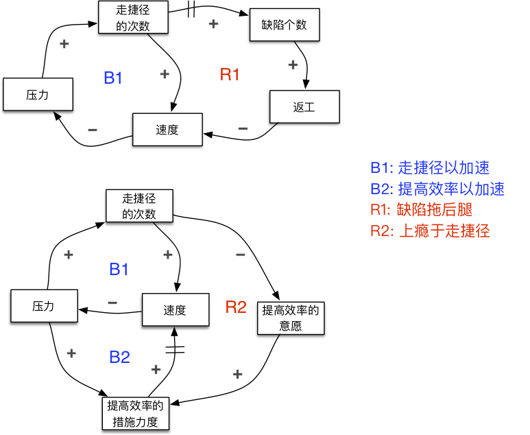

###组织变革

我们用另外两个问题对组织变革进行建模分析：

1. 对某项变革有什么推动力可以借用？
1. 对某项变革有什么限制力需要削弱？

这两个问题跟常用的力场分析法（Force Field Analysis）有些类似，不同的是我们会去寻找可以借用的增强回路和识别需要削弱的平衡回路，而力场分析法往往止步于线性因果关系。

以导入某个实践为例：

1. 有什么能推动这个实践的开展？让已经在做这个实践的团队分享，和其它团队交流，从而带动尝试的热情，使得更多团队开始导入该实践。这里有一个增强回路，可以命名为“交流促热情”。
1. 有什么会限制这个实践的开展？团队导入新的实践时需要辅导，而辅导资源有限，使得没法同时给太多团队提供有效辅导，这就形成了一个平衡回路，可以命名为“辅导成瓶颈”。

两个回路形成了“成长上限”的系统基模。这里我们只是识别了一个增强回路和一个平衡回路，而实际上会有更多增强回路来推动变革，也会有更多平衡回路来限制变革。

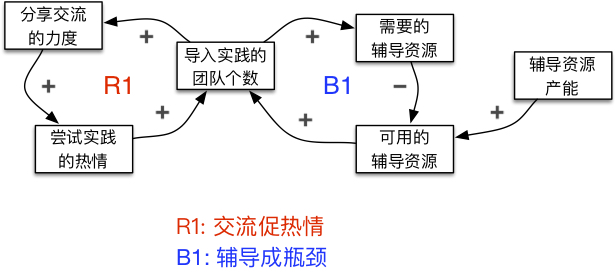

##总结

这一章是给后续章节基于系统思考的分析做个准备。系统思考是个专门的学科，有很多书可以参考学习，所以本章只是结合产品开发这个领域的例子阐述了我们会应用到的一些基础知识。

回路是核心，回路由一些变量和链路形成，而多个回路又形成系统基模。我们会在书中采用正向（+）和负向（-）标注链路，采用R和B分别标注增强回路和平衡回路，并对回路进行命名。

系统本身的定义就是多个因素相互作用，所以应用系统思考分析的一个难点是不知道从哪里着手，为此我们分享了两个思路，分别应用于组织设计和组织变革的分析。
